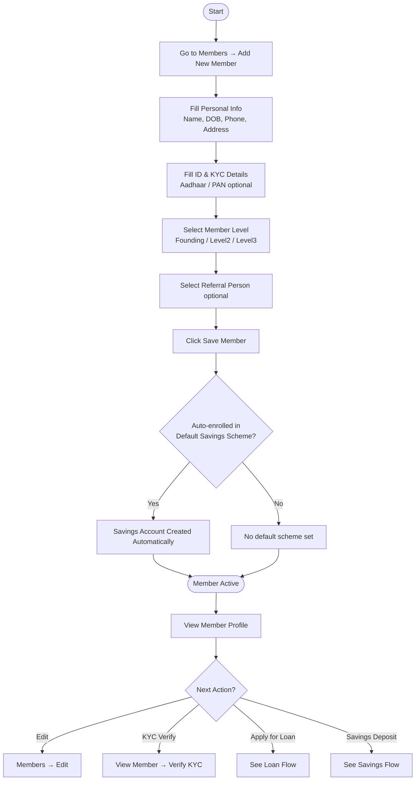
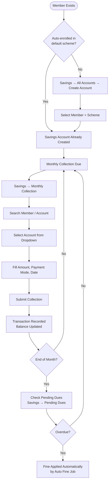
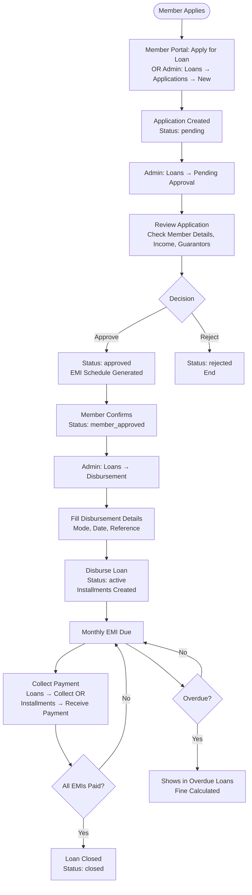
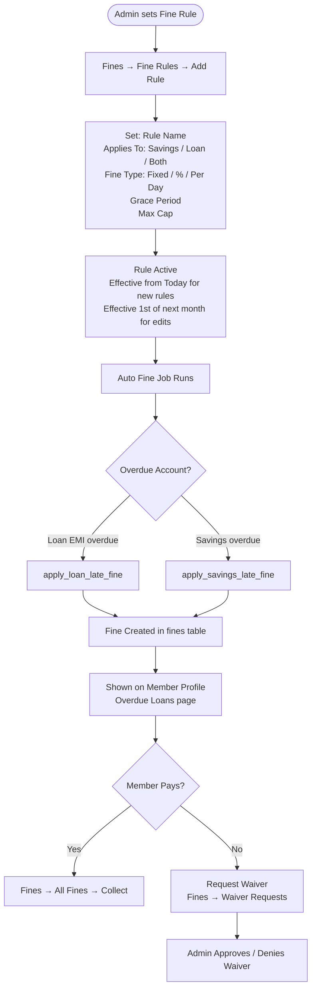
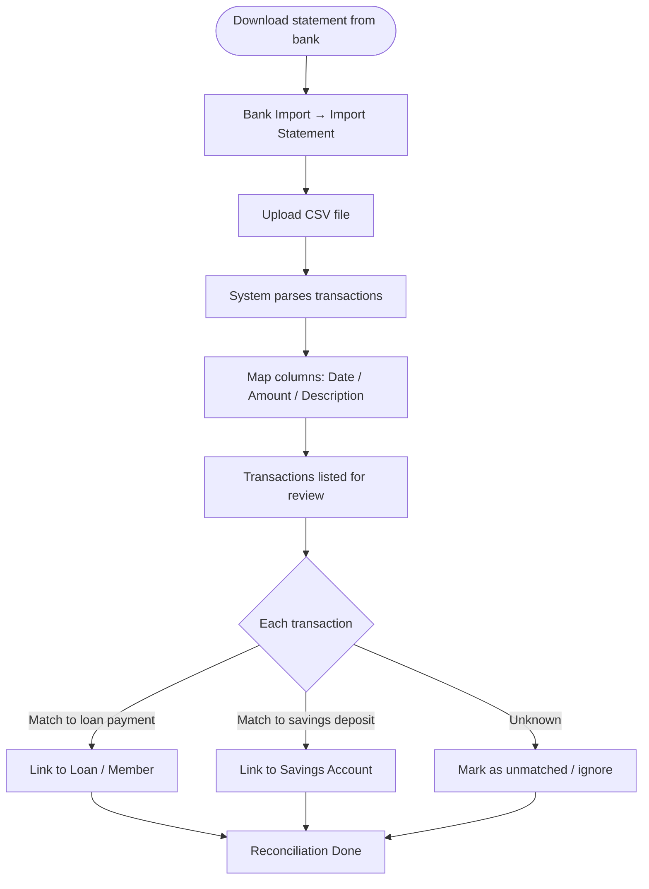
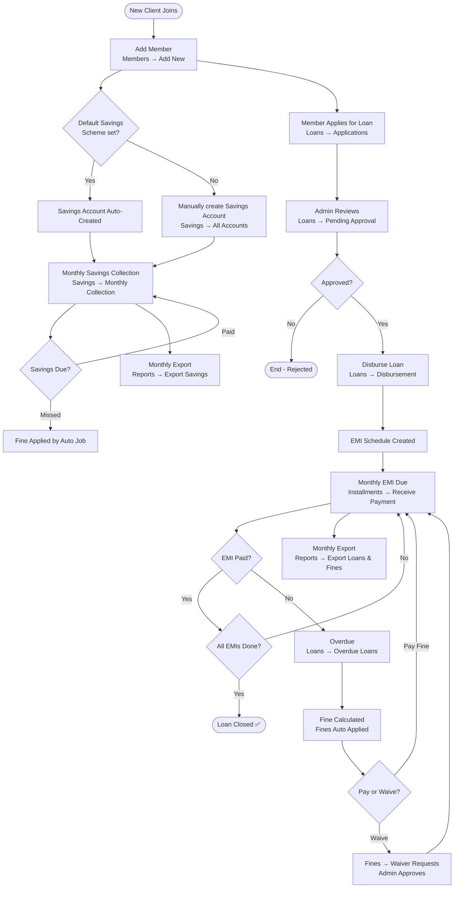

# Windeep Finance — Complete Application User Guide

---

## Table of Contents

1. [Application Overview](#1-application-overview)
2. [Login & Dashboard](#2-login--dashboard)
3. [Member Management](#3-member-management)
4. [Savings Management](#4-savings-management)
5. [Loan Management](#5-loan-management)
6. [Installments & EMI Payments](#6-installments--emi-payments)
7. [Fines & Penalties](#7-fines--penalties)
8. [Bank Statement Import](#8-bank-statement-import)
9. [Reports & Exports](#9-reports--exports)
10. [Settings & Administration](#10-settings--administration)
11. [Full Application Flow](#11-full-application-flow)
12. [Common Workflows (Step-by-Step)](#12-common-workflows-step-by-step)

---

## 1. Application Overview

Windeep Finance is a **microfinance management system** for managing:
- Member (customer) records
- Savings accounts and monthly collections
- Loan applications, approvals, disbursements, and repayments
- EMI schedules and repayment tracking
- Fines on overdue loans and savings
- Bank statement import and reconciliation
- Reports and data exports

**Technology Stack:** PHP / CodeIgniter 3 · MySQL · AdminLTE · Bootstrap 4

**Base URL:** `http://localhost/windeep_finance/admin/`

---

## 2. Login & Dashboard

### Login
1. Go to `http://localhost/windeep_finance/admin/`
2. Enter admin username and password
3. Click **Login**

### Dashboard Shows
| Widget | Description |
|---|---|
| Total Members | Count of all active members |
| Active Loans | Loans currently disbursed |
| Overdue EMIs | EMIs past due date |
| Today's Collection | Savings + loan payments received today |
| Pending Approvals | Loan applications awaiting admin action |
| Overdue Loans | Loans with missed installments |

---

## 3. Member Management

### Flow

### Member Fields Explained

| Field | Required | Notes |
|---|---|---|
| First / Last Name | ✅ Yes | |
| Phone | ✅ Yes | Used for reminders |
| Date of Birth | ❌ Optional | |
| Gender | ❌ Optional | |
| ID Type / ID Number | ❌ Optional | |
| Pincode | ❌ Optional | |
| Member Level | ✅ Yes | founding_member / level2 / level3 |
| Referral Person | ❌ Optional | Search from existing members |

### How to Edit a Member
1. **Members → All Members** → click member row
2. Click **Edit** button on member view page
3. Update fields → **Save Changes**

### How to Verify KYC
1. Open member profile
2. Click **Verify KYC** button
3. Status changes to KYC Verified (green badge)

---

## 4. Savings Management

### Flow

### Savings Schemes
- Go to **Savings → Savings Schemes**
- Each scheme has: name, monthly amount, interest rate, tenure
- One scheme is marked as **Default** (⭐ star icon)
- The default scheme auto-enrolls every new member
- **To set default:** Click **Set Default** button next to any scheme
- **Default scheme cannot be deactivated** (🔒 locked)

### Collecting a Monthly Payment
1. **Savings → Monthly Collection**
2. Search for the member using the dropdown (type name or member code)
3. Select the savings account from the list shown
4. Fill in: Amount, Payment Mode (Cash/UPI/Cheque), Date
5. Click **Record Payment**

### Checking Pending Dues
- **Savings → Pending Dues** shows all accounts with overdue installments

---

## 5. Loan Management

### Full Loan Lifecycle Flow

### Loan Application Steps (Admin)
1. Go to **Loans → Applications → New**
2. Select member, loan product, amount, tenure
3. Add guarantors if required (system emails guarantor for consent)
4. Submit application
5. Approve from **Loans → Pending Approval**

### Loan Products
- **Loans → Loan Products** — manage available loan types
- Each product has: interest rate, tenure range, processing fee, min/max amount

### Viewing a Loan
- **Loans → All Loans** → click loan number
- Shows: member info, EMI schedule, repayment history, total outstanding

### Collecting an EMI Payment
1. **Loans → All Loans** → click loan → **Collect Payment**
2. OR **Installments → Receive Payment** → search by loan/member
3. Enter amount, payment mode, date → **Submit**

### Overdue Loans
- **Loans → Overdue Loans** shows all missed EMIs
- Fine amount shown (estimated if auto-fine job not yet run)
- Click **Apply Fines** button to trigger fine calculation immediately

---

## 6. Installments & EMI Payments

### Installment Statuses

| Status | Meaning |
|---|---|
| upcoming | Future EMI, not yet due |
| pending | Due date has passed, not paid |
| partial | Partially paid |
| paid | Fully paid |
| overdue | Past due (used similarly to pending) |
| waived | Waived off by admin |

### Submenu Options

| Menu Item | Purpose |
|---|---|
| Due Today | EMIs due on today's date |
| Upcoming | EMIs due in the next 30 days |
| Overdue | All missed EMIs |
| Receive Payment | Record a loan repayment |
| Payment History | Full repayment audit trail |

---

## 7. Fines & Penalties

### Fine Rules Flow

### Fine Types Explained

| Fine Type | How Calculated | Example |
|---|---|---|
| **Fixed** | One flat amount | ₹100 every time overdue |
| **Percentage** | % of overdue amount | 2% of EMI amount |
| **Per Day** | Initial amount + daily charge | ₹100 + ₹10/day after grace |

### Setting a Fine Rule
1. **Fines → Fine Rules → Add Rule**
2. Fill: Rule Name, Applies To, Fine Type, Amount, Grace Period, Max Cap
3. Click **Save Rule**
4. New rules are effective **immediately**
5. Edited rules take effect **1st of next month**

### Running Auto Fine Job
- **Fines → Fine Rules → Run Auto Fine Job** (button at bottom of page)
- OR from **Loans → Overdue Loans → Apply Fines** button
- Calculates and creates fine records for all overdue accounts

### Waiver Process
1. Member/admin requests waiver: **Fines → Waiver Requests**
2. Admin reviews and approves / denies
3. On approval, fine amount is reduced by waiver amount

---

## 8. Bank Statement Import

### Import Flow

### Steps
1. **Bank Import → Import Statement**
2. Upload your bank's CSV file
3. Map the columns (Date, Credit Amount, Debit Amount, Narration)
4. Review parsed transactions
5. Link each transaction to the appropriate member/loan/savings account
6. Save mappings

### Bank Accounts
- **Bank Import → Bank Accounts** — register your organisation's bank accounts used for disbursements and collections

---

## 9. Reports & Exports

### One-Click Exports (Sidebar → Reports)

| Export | Contents | Format |
|---|---|---|
| **Export Members** | All member data (personal, KYC, bank, nominee) | CSV |
| **Export Loans & Fines** | Sheet 1: Loans summary · Sheet 2: All installments · Sheet 3: All fines | Excel (XLSX) |
| **Export Savings** | Sheet 1: Savings accounts · Sheet 2: All transactions | Excel (XLSX) |

> If PHPSpreadsheet is not installed, Loan and Savings exports fall back to CSV automatically.

### How to Export
1. Click the export link in **Reports** sidebar section
2. File downloads immediately — no filters needed (full data dump)

### Legacy Reports (commented out but accessible via direct URL)

| URL | Report |
|---|---|
| `/admin/reports/collection` | Monthly collection report |
| `/admin/reports/outstanding` | Outstanding loan report |
| `/admin/reports/overdue` | Overdue EMI report |
| `/admin/reports/member-statement` | Individual member statement |

---

## 10. Settings & Administration

### General Settings
- **Settings → General Settings**: Company name, address, logo, financial year, SMS/email settings

### Backup & Restore
- **Settings → Backup & Restore**: Download full database backup as SQL file

### Audit Logs
- **Audit Logs** (sidebar): Full audit trail of all admin actions (who changed what and when)

### Admin Users
- Manage admin accounts and roles via **Settings → Users**

---

## 11. Full Application Flow

---

## 12. Common Workflows (Step-by-Step)

### ✅ Workflow 1: Onboard a New Member

1. **Members → Add New Member**
2. Enter: First Name, Last Name, Phone
3. Select **Member Level** (founding_member / level2 / level3)
4. Click **Save Member**
5. System auto-enrolls member in the default savings scheme
6. Verify KYC from member profile when documents collected

---

### ✅ Workflow 2: Collect Monthly Savings

1. **Savings → Monthly Collection**
2. In the search box, type member name or code — select from dropdown
3. Click the account shown in the table
4. Amount auto-filled from scheme → adjust if needed
5. Select Payment Mode (Cash / UPI / Cheque / NEFT)
6. Click **Record Payment**

---

### ✅ Workflow 3: Process a Loan (End to End)

1. **Loans → Applications → New** — select member, product, amount
2. **Loans → Pending Approval** — click Approve
3. Member confirms (or admin confirms on behalf)
4. **Loans → Disbursement** — click Disburse, fill date and mode
5. Each month: **Installments → Receive Payment** — collect EMI
6. After last EMI: loan auto-closes

---

### ✅ Workflow 4: Handle an Overdue Loan

1. **Loans → Overdue Loans** — see all overdue EMIs with estimated fine
2. Click **Apply Fines** (top button) to formally create fine records
3. Contact member — collect EMI + fine together
4. **Installments → Receive Payment** — record EMI
5. **Fines → All Fines** — click fine → **Collect** — record fine payment
6. If member requests waiver: **Fines → Waiver Requests → New**

---

### ✅ Workflow 5: Month-End Export

1. **Reports → Export Members** — downloads all member data as CSV
2. **Reports → Export Loans & Fines** — downloads Excel with 3 sheets
3. **Reports → Export Savings** — downloads Excel with 2 sheets
4. Open files in Excel / Google Sheets for analysis

---

### ✅ Workflow 6: Set Up Fine Rules (First Time)

1. **Fines → Fine Rules → Add Rule**
2. Example configuration (standard Indian microfinance):
   - Rule Name: `Late Payment Fine`
   - Applies To: `Both Savings & Loans`
   - Fine Type: `Fixed + Per Day`
   - Fine Amount: `₹100` (initial charge)
   - Per Day Amount: `₹10` (daily after grace)
   - Grace Period: `10 days`
   - Max Cap: leave empty (no limit)
3. Click **Save Rule**
4. Run **Auto Fine Job** once to apply to existing overdues

---

### ✅ Workflow 7: Import Bank Statement

1. Download CSV statement from your bank's internet banking portal
2. **Bank Import → Import Statement** — upload the file
3. Map columns: select which CSV column is Date, Amount, Description
4. Review parsed transactions — link each to the appropriate member/account
5. Save — transactions are recorded and reconciled

---

## Quick Reference: URL Cheat Sheet

| Action | URL |
|---|---|
| Dashboard | `/admin/dashboard` |
| All Members | `/admin/members` |
| Add Member | `/admin/members/create` |
| All Savings Accounts | `/admin/savings` |
| Monthly Collection | `/admin/savings/collection` |
| Savings Schemes | `/admin/savings/schemes` |
| All Loans | `/admin/loans` |
| Loan Applications | `/admin/loans/applications` |
| Pending Approval | `/admin/loans/pending-approval` |
| Disbursement Queue | `/admin/loans/disbursement` |
| Overdue Loans | `/admin/loans/overdue` |
| Due Today (EMI) | `/admin/installments/due-today` |
| All Fines | `/admin/fines` |
| Fine Rules | `/admin/fines/rules` |
| Waiver Requests | `/admin/fines/waiver-requests` |
| Bank Import | `/admin/bank/import` |
| Export Members | `/admin/reports/export_members` |
| Export Loans & Fines | `/admin/reports/export_loans_full` |
| Export Savings | `/admin/reports/export_savings_full` |
| Audit Logs | `/admin/settings/audit_logs` |
| General Settings | `/admin/settings` |
| Backup | `/admin/settings/backup` |

---

*Last updated: February 2026 · Windeep Finance v1.0.0*
